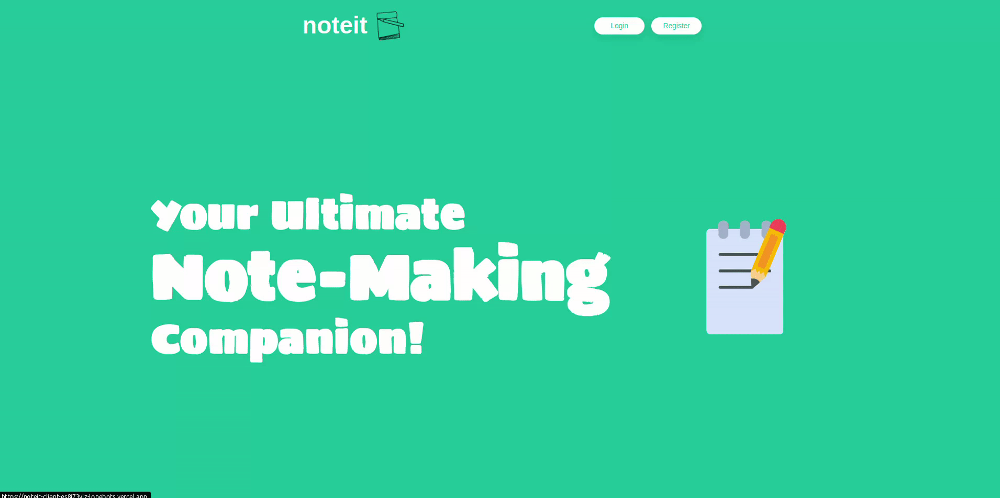

<h1 align="center">noteit</h1>

A simple note-taking application built using the MERN stack (MongoDB, Express.js, React.js, and Node.js). This application allows users to create, read, update, and delete notes, providing a convenient way to organize and manage their thoughts, tasks, and important information. With a clean and intuitive user interface, users can easily add new notes, edit existing ones, and delete notes they no longer need. The MERN Note Taking Application utilizes the power of the MERN stack to deliver a seamless and efficient note-taking experience. Get started and boost your productivity today!

## Features

- **Authentication:** Web token based user authentication.
- **Create notes:** Add new notes with a title and content.
- **View notes:** Read and access all your notes in a simple and organized manner.
- **Update notes:** Edit and update the content of your existing notes.
- **Delete notes:** Remove unwanted or completed notes from your collection.
- **Responsive UI:** Enjoy a responsive user interface that adapts to various screen sizes.

## Technologies Used

- **MongoDB:** A document-oriented NoSQL database for storing notes and user information.
- **Express.js:** A web application framework for building the server-side RESTful API.
- **React.js:** A JavaScript library for building the user interface and handling the view layer.
- **Node.js:** A JavaScript runtime environment for executing server-side code.
- **Mongoose:** An object modeling tool for MongoDB to simplify data validation and interaction.
- **Axios:** A promise-based HTTP client for making API requests to the server.

## Installation

1. Clone the repository: `git clone https://github.com/lonebots/noteit.git`
2. Navigate to the project directory: `cd noteit`
3. Install the dependencies: `yarn install`
4. Set up environment variables:
   - Create a `.env` file in the `server` root directory.(refer `sample.env`)
   - Define the following variables: `MONGODB_URI`, `PORT`, `ACCESS_TOKEN_SECRET_KEY`.
5. Start the development server: `yarn dev`.
6. Start react server : `yarn start`.
7. Open your browser and visit: `http://localhost:3000`

## License

This project is licensed under the MIT License. See the [LICENSE](LICENSE) file for more details.

## Contribution

Please follow guidelines provided [here](./CONTRIBUTING.md).

---

Made with ❤️

